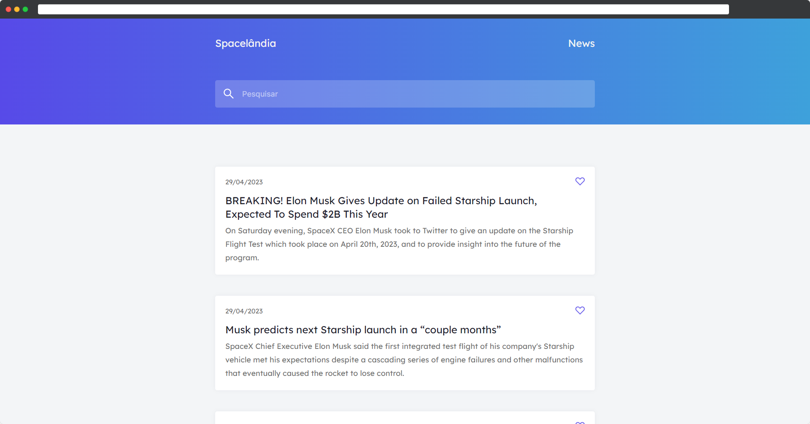

# Spacelândia

<h1 align="center">
    
</h1>

<br>

## 🧪 Technologies

This project was developed using the following technologies:

-   [HTML](https://html.spec.whatwg.org/multipage/)
-   [CSS](https://www.w3.org/TR/css-2022/)
-   [TS](https://www.typescriptlang.org/)
-   [Vite](https://vitejs.dev/)

## 🚀 Getting started

Clone the project and access the folder.

```bash
git clone https://github.com/tiagotnx/desafios_codelandia.git

cd desafios_codelandia

cd desafio01

```

Run this command to install the dependencies.

```bash
npm install

npm run start
```

## 🔖 Layout

You can view the project through the links below:

-   [Live Preview](https://spacelandia.netlify.app/)

-   [Figma](https://discord.com/channels/853354677411905578/853363178901733387/858725291211882497)

Remembering that you need to have a [Figma](http://figma.com/) account to access it.

## 📝 License

This project is licensed under the MIT License. See the [LICENSE](LICENSE) file for details.

---

Made with 💜 by [TiagoTNX](https://github.com/TiagoTNX) 👋
