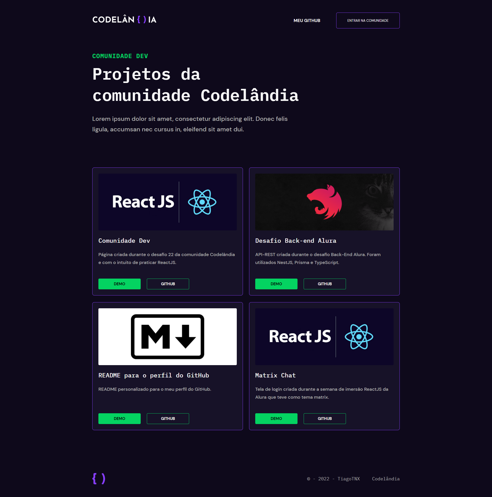
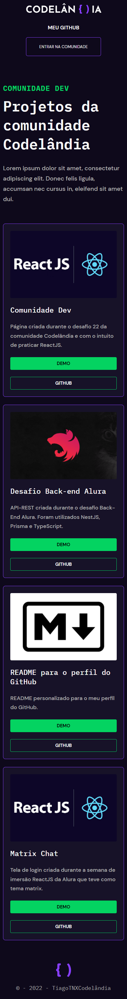

# Desktop

<h1 align="center">
    
</h1>

<br>

# Mobile

<h1 align="center">
    
</h1>

<br>

## 🧪 Technologies

This project was developed using the following technologies:

- [ReactJS](https://reactjs.org/)
- [Styled Components](https://styled-components.com/)

## 🚀 Getting started

Clone the project and access the folder.

```bash
git clone https://github.com/TiagoTNX/Comunidade_Dev-Desafio22.git

cd Comunidade_Dev-Desafio22

```

Run this command to install the dependencies.

```bash
npm install

npm run start
```

## 🔖 Layout

You can view the project through the links below:

- [Live Preview](https://comunidade-dev.vercel.app/)

- [Figma](https://www.figma.com/file/Yb9IBH56g7T1hdIyZ3BMNO/Desafios---Codel%C3%A2ndia?node-id=70013%3A760)

Remembering that you need to have a [Figma](http://figma.com/) account to access it.

## 📝 License

This project is licensed under the MIT License. See the [LICENSE](LICENSE) file for details.

---

Made with 💜 by [TiagoTNX](https://github.com/TiagoTNX) 👋
